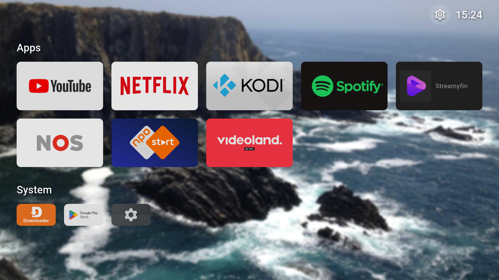

# PitchforkLauncher



A personal fork of FLauncher, an open source Android TV launcher, with a modernized stack and a
few new features. Built for and tested on a Google TV Streamer 4K (Android 14). Untested on other
devices. This is a personal project. No feature requests, no ongoing support. Shared in case
others find it useful.

## Features

- **No external telemetry.** No Firebase, no analytics, no crash reporting, nothing phoning home.
- **No ads, no suggestions. Focus on core functionality of a laucher**
- **Home Button override** (Accessibility Service): become the home screen without disabling the
  stock launcher, so things like the remote's dedicated YouTube button keep working. Comes with a
  trade off, see "Set as default launcher" below.
- **Remote button remapping**: map any other physical remote button to launch an app of your
  choice (Settings > Remote buttons).
- **Key-less random wallpaper**, backed by [picsum.photos](https://picsum.photos). No API key
  needed.
- **Modern toolchain**, current as of July 2026 (Flutter, AGP, Kotlin, compileSdk).
- Customizable categories, manually reorderable

## Installation

Grab the latest APK from [Releases](https://github.com/yoramvandevelde/pitchforklauncher/releases)
and `adb install` it, or build it from source:

```shell
git clone https://github.com/yoramvandevelde/pitchforklauncher.git
cd pitchforklauncher
fvm install
fvm flutter build apk --debug
adb install build/app/outputs/flutter-apk/app-debug.apk
```

Builds `--debug` here on purpose: a `--release` build needs the private signing keystore, which
isn't part of this repo. The Releases APK above is the signed release build.

See `AGENTS.md` for the full toolchain setup (FVM, JDK 25, the `just` recipes used below). Once
installed, see "Set as default launcher" below to make it your home screen.

## Set as default launcher

Three ways to make PitchforkLauncher your home screen. Pick based on what matters more to you.

| | Back button acts like a real home screen | YouTube remote button | Disables stock launcher | Extra app needed |
|---|---|---|---|---|
| **A: Real default launcher** | Yes | Works via this fork's own remapping (pre-mapped by default) | Yes | No |
| **B: Home Button override** (built-in) | No — exits the launcher | Works untouched, stock launcher still handles it | No | No |
| **C: Third-party remap** | No — exits the launcher | Works untouched, stock launcher still handles it | No | Yes ([Button Mapper](https://play.google.com/store/apps/details?id=flar2.homebutton)) |

See Known limitations below for the Back-button trade-off shared by B and C.

**Option A** (what I run myself):

```shell
just disable-default-launcher <device-serial>
```

The next time you press Home, Android prompts you to choose PitchforkLauncher. To undo:

```shell
just restore-default-launcher <device-serial>
```

Tested on a Google TV Streamer 4K only — at your own risk on other devices. If your remote sends a
different code for the YouTube button and it doesn't come back automatically, remap it yourself in
Settings > Remote buttons.

**Option B**: enable `HomeButtonAccessibilityService` in Android's Accessibility settings.

**Option C**: use [Button Mapper](https://play.google.com/store/apps/details?id=flar2.homebutton)
to remap the remote's Home button to PitchforkLauncher instead of enabling Option B.

## Known limitations

- **Back button exits the launcher** instead of doing nothing, when not using Option A. Not
  something this fork tries to fix, see `TODO.md` for why.
- **Custom wallpaper images need a file explorer app** installed on the device to pick a file
  from. The built-in random wallpaper source (see Features) doesn't need this.

## About this fork

Not an Android or Flutter developer — used Claude (Anthropic's AI) for almost all of the coding,
made the design decisions and did the testing personally. See `DRIFT.md` and `UPGRADE_PLAN.md` for
the detailed history of what changed and why.

---

A personal fork of [FLauncher](https://gitlab.com/flauncher/flauncher) by Étienne Fesser. Thanks
for the solid foundation this is built on. Not affiliated with the original project or its Play
Store listing. Licensed under GPL-3.0, see `LICENSE`.
